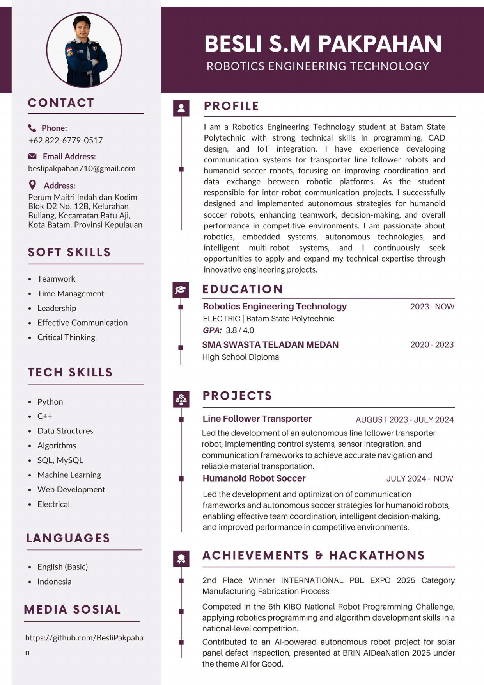
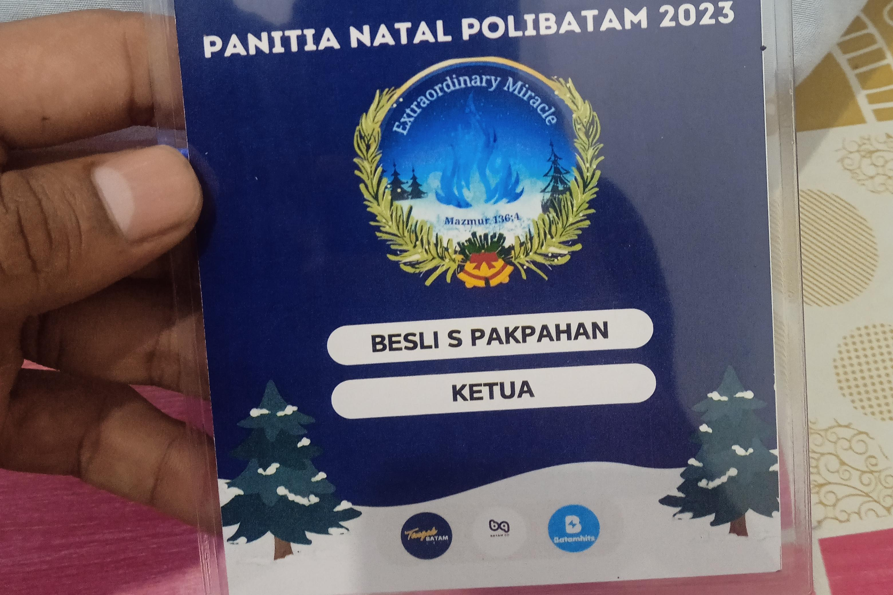
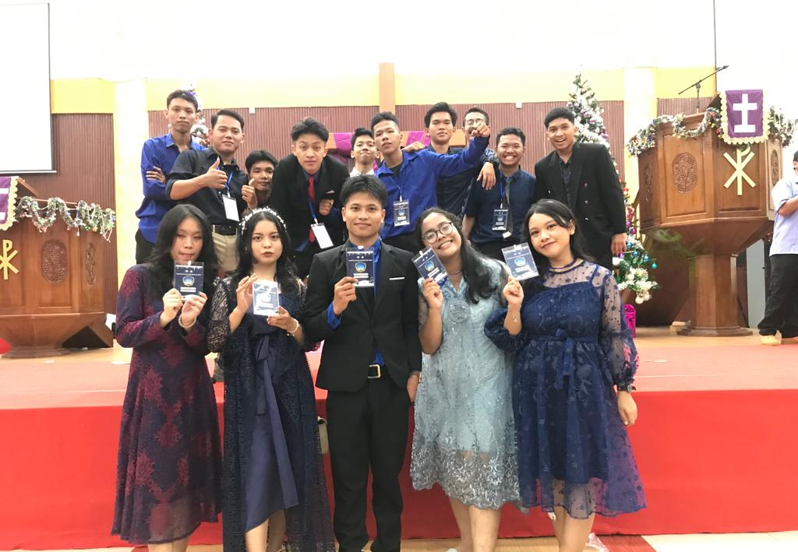
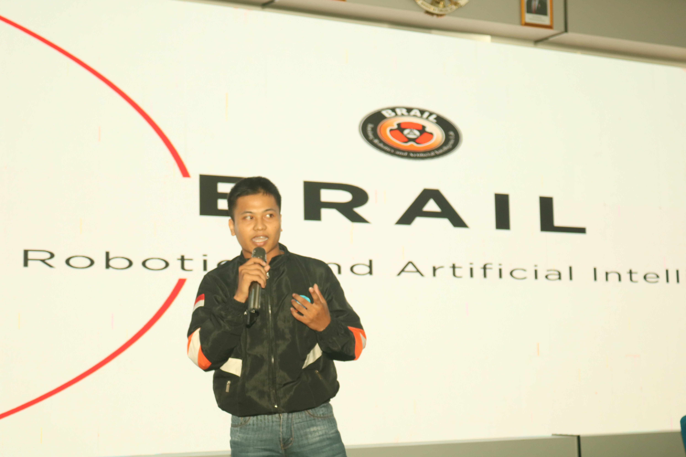
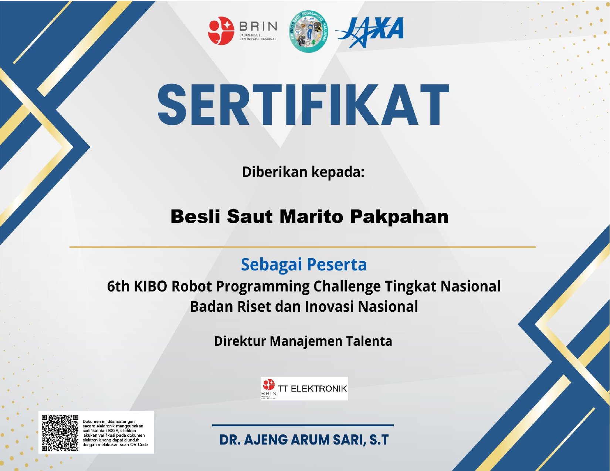
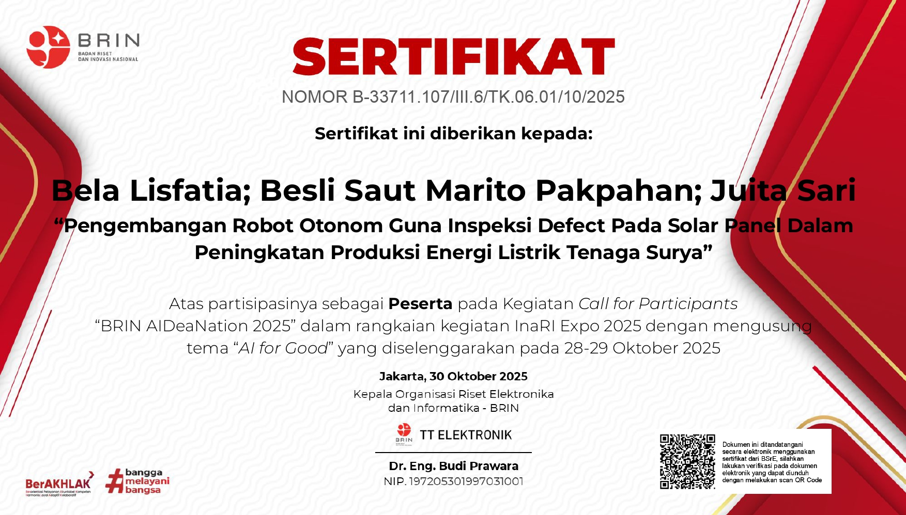

  

<h3 align="center">ROBOTICS ENGINEERING TECHNOLOGY</h3>

  Welcome to my GitHub profile I am a Robotics Engineering Technology student at Batam State Polytechnic with strong technical skills in programming, CAD design, and loT integration. I have experience developing communication systems for transporter line follower robots and humanoid soccer robots, focusing on improving coordination and data exchange between robotic platforms. As the student responsible for inter-robot communication projects, I successfully designed and implemented autonomous strategies for humanoid soccer robots, enhancing teamwork, decision-making, and overall performance in competitive environments. I am passionate about robotics, embedded systems, autonomous technologies, and intelligent multi-robot systems, and I continuously seek opportunities to apply and expand my technical expertise through innovative engineering projects.

---

## Curriculum Vitae

  

---

## Activities & Experiences

Here are some moments from my recent activities, leadership roles, and public speaking engagements:

  <table>
    <tr>
      <td align="center">
         
        <b>Ketua Natal</b>
      </td>
      <td align="center">
         
        <b>Jajaran Pengurus</b>
      </td>
      <td align="center">
         
        <b>Sebagai Pemateri</b>
      </td>
    </tr>
  </table>

---

## Certificates & Achievements

Continuous learning and active participation are core to my journey. Here are some of the certifications I have achieved:

### Certificate Previews

  <table>
    <tr>
      <td align="center">
         
        <b>Sertifikat KIBO</b>
      </td>
      <td align="center">
         
        <b>Sertifikat AIDeaNation</b>
      </td>
    </tr>
    <tr>
      <td align="center">
         
        <b>Sertifikat BRAIL Polibatam</b>
      </td>
      <td align="center">
         
        <b>Teknologi Tepat Guna</b>
      </td>
    </tr>
    <tr>
      <td align="center" colspan="2">
         
        <b>Sertifikat Penghargaan / Keikutsertaan</b>
      </td>
    </tr>
  </table>

 

  

  <i>"Committed to learning, innovating, and contributing to the community."</i>

